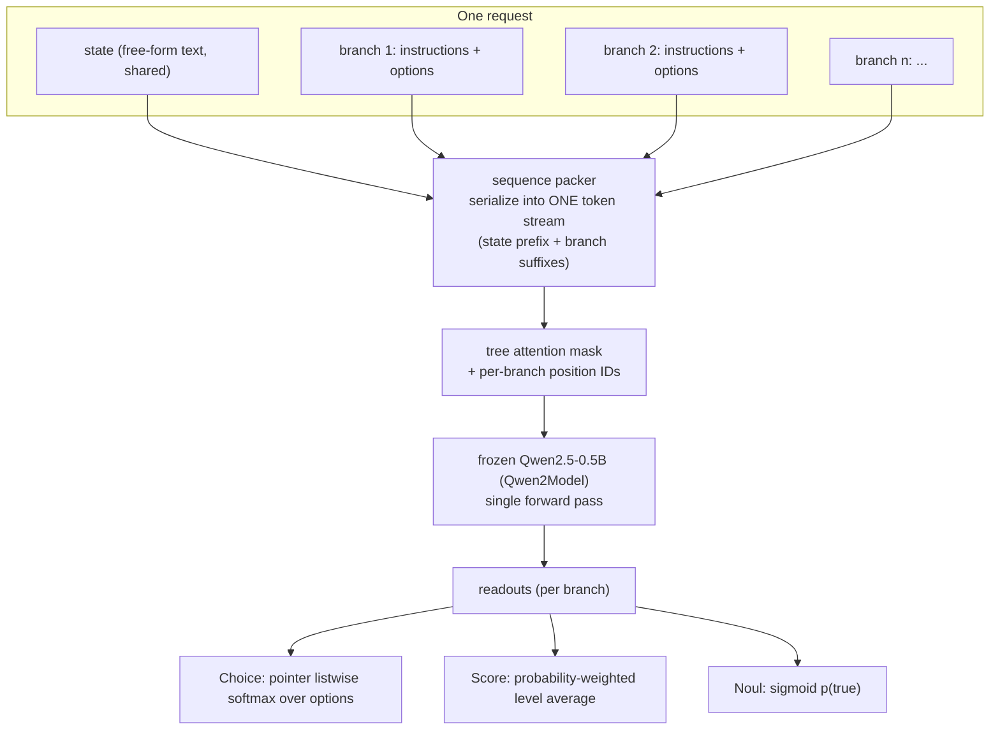

# Jev-Style Multi-Question Inference: A Minimal Reproduction

A from-scratch, single-forward implementation of a Jev-style "System One" inference
architecture: one shared **state** (free-form text), many **questions**, all answered in
**one forward pass** of a frozen [Qwen2.5-0.5B](https://huggingface.co/Qwen/Qwen2.5-0.5B)
backbone — with a tree attention mask, per-branch position IDs, and a pointer-style
listwise readout trained on top.

The design is a *reconstruction* from publicly described Jev behavior (one shared state,
many typed questions, sub-linear serving cost, listwise option interaction), not a claim
about the actual internals of the proprietary model.

## Architecture



### 1. Sequence packing (`model/packer.py`)

State is tokenized once and placed as a prefix; every question becomes a *branch*
appended after it:

```text
[ state tokens ] <STATE_END>
                 [ branch 1: instructions ] [ opt 1 ] <SEP> ... [ opt K ] <SEP> <DECISION>
                 [ branch 2: instructions ] [ ... ] <DECISION>
                 ...
```

- Three special tokens are added to the tokenizer: `<STATE_END>`, `<SEP>`, `<DECISION>`.
- The hidden state of `<DECISION>` — placed *after* all options of its branch — is the
  only readout point for that question's answer.
- **Noul** (yes/no) branches carry no options: `[ instructions ] <DECISION>`.
- **Score** (ordinal) branches list the level descriptions of `criteria` exactly like
  Choice options.
- Question IDs never enter the token stream; the caller maps branch outputs back to IDs.

### 2. Tree attention mask + per-branch position IDs (`model/tree_mask.py`)

Branches can never see each other; everyone sees the whole state:

```text
mask(i, j) = [j <= i] AND ( [j in state] OR [branch(i) = branch(j)] )
```

Position IDs are re-numbered **per branch**: the state keeps `0 .. S-1`, and every branch
starts again at `S` regardless of how many siblings precede it. Mask alone is not enough —
with plain running indices, inserting a branch would shift the position IDs of all later
branches and change their hidden states even though they are attention-isolated. Together
the two guarantee *isolation*: adding, removing, or reordering questions cannot change
another question's answer.

### 3. Readouts (`model/readout.py`)

**Choice / Score share one pointer-style listwise scorer** (a single cross-attention
head; the number of options K is free at run time — no fixed-size classification head):

```text
z_i = (W_q h_dec) · (W_k h_opt_i) / sqrt(d)      p = softmax(z)
```

where `h_dec` is the `<DECISION>` hidden state and `h_opt_i` the last-token hidden state
of option *i*. Score's final value is the probability-weighted average
`score = sum_i i * p_i` (levels are 1-based).

**Noul** uses a linear + sigmoid head on `h_dec`: `p_true = sigmoid(w^T h_dec + b)`.

Why listwise interaction falls out for free: `h_dec` sits at the branch end, so causal
attention makes it read *all* options; `h_opt_i` cannot see later options. Append an
irrelevant option K+1 and every `h_opt_i` stays bit-identical while `h_dec` moves — so
the log-odds of existing options can shift. Independent-scoring designs cannot do this
in principle.

### 4. End-to-end model (`model/forward.py`)

`JevModel` = frozen `Qwen2Model` backbone (24 layers, hidden 896, GQA 14/2 heads,
float32) + packer + mask/position builder + readouts. One `forward(request)` call returns
per-branch probabilities. Only the readout weights are trainable; the backbone is never
updated.

### 5. Baselines (`baselines/`)

- **naive re-encode** — same backbone and readout weights, but each branch is forwarded
  independently as `[state] + [branch]`. Isolates the *serving* difference (shared-prefix
  packing vs. N separate passes) from the architecture.
- **independent scorer** — state and each option encoded separately, scored by raw dot
  product `z_i = h_state · h_opt_i`. Provably invariant: adding an option cannot move the
  log-odds of existing options (each `h_opt_i` sees no other option; the softmax
  denominator cancels).

## Repository layout

```text
model/        backbone, packer, tree mask, readouts, end-to-end JevModel
baselines/    naive re-encode, independent scorer
data/         AG News loading + conversion to packed requests
experiments/  sanity_check (structural verification), train, scaling_curve
results/      recorded run outputs (markdown, dated)
```

Run with `python3 -m experiments.sanity_check` / `experiments.train` /
`experiments.scaling_curve` from the repo root (needs `torch`, `transformers`,
`datasets`; CPU-only is fine). Each module also has a `_smoke_check` runnable directly.

## Verifications and results

All structural checks run **before any training** (random-init readout, pretrained frozen
backbone), seeds fixed for reproducibility. Recorded outputs live in `results/`.

### Isolation — other questions cannot change an existing answer

Added two more questions before/after/around a target choice branch; probabilities of the
target are unchanged:

```text
max |Δp| = 1.94e-05   (acceptance threshold 1e-03)
```

The residual is float32 matmul non-associativity in eager dense attention (the embedding
layer stays bit-exact), not a mask/position bug.

### Latency — one packed pass vs. N re-encodes

Same weights, same questions; wall time of one `JevModel.forward` vs. N independent
re-encodes (CPU, min of 3 reps):

| N (branches) | tree mask | naive re-encode | ratio |
|---:|---:|---:|---:|
| 1 | 119.9 ms | 121.6 ms | 1.01x |
| 2 | 133.2 ms | 242.9 ms | 1.82x |
| 4 | 188.0 ms | 506.2 ms | 2.69x |
| 8 | 261.9 ms | 1143.7 ms | 4.37x |
| 16 | 515.1 ms | 2379.9 ms | 4.62x |

Growth N=1→16: **4.3x vs. 19.6x**. Note: this implementation uses eager dense attention,
so the QK^T product is still computed over the full packed (T, T). The theoretical
`O(S + ΣQ_i)` of dedicated shared-prefix KV implementations (Hydragen/DeFT style) is not
reproduced; the measured gap is packing vs. N separate passes.

### Listwise interaction — adding an irrelevant option moves existing log-odds

Appending one irrelevant option to a 2-option question:

| Model | log-odds shift of the original pair |
|---|---:|
| JevModel (pointer readout) | **-5.618** (moves) |
| independent scorer (baseline) | **0.000000** (bit-exact, as provable) |

The pointer readout reproduces the externally observed "adding an option perturbs the
relative standing of the existing options"; the independent scorer cannot, by
construction.

### Order sensitivity — permuting options changes output probabilities

8 cases (4 states: 1 synthetic + 3 held-out AG News articles × 2 option sets: short
labels / criteria-rich) × **all 24 permutations** of 4 options, before and after a light
readout training (AG News 200 examples, 1 epoch, train acc 0.43):

| Metric (32 options pooled) | untrained | after light training |
|---|---:|---:|
| probability range (mean) | 0.974 | 0.938 |
| probability range (max) | 1.000 | 1.000 |
| fraction exceeding 1e-3 noise floor | 1.00 | 0.94 |
| top-1 stability across permutations | 0.12–1.00 | 0.42–0.83 |
| mean confidence (max prob) | 0.987 | 0.992 |

Interpretation: softmax is monotone, so 0/1 saturation alone can never change the
argmax. Post-training top-1 stability of 0.42–0.83 means the *highest-ranked option
itself* flips in 17–58% of permutations — the logit ordering moves with option order.
This is a structural property of within-branch causal attention (later options attend to
earlier ones; `<DECISION>` sees a different context per ordering), not a saturation
artifact. The ≈1.0 probability *magnitudes* are, however, amplified by the still-saturated
readout (see training note below).

## Training

Post-training setup: **`PointerReadout` only** (`W_q`, `W_k` — two 896×896 matrices,
≈1.6M params, no biases), backbone frozen; cross-entropy loss on the choice logits;
Adam, lr 1e-3, batch size 1 (no padding). Task: AG News topic classification
(state = article, options = 4 classes with short criteria descriptions).
Held-out eval = 500 test-split articles; ECE with 10 bins.
The `NoulReadout` stays untrained (AG News has no yes/no questions) — intentional
limitation.

| Run | Train size (AG News) | Epochs | Accuracy | ECE |
|---|---:|---:|---:|---:|
| random init (no training) | 0 | – | 0.2260 | 0.5664 |
| scaling | 500 | 1 | 0.6200 | 0.3779 |
| scaling | 2,000 | 1 | 0.8180 | 0.1800 |
| scaling | 10,000 | 1 | **0.8300** | **0.1706** |
| scaling | 20,000 | 1 | 0.7720 | 0.2280 |
| full post-train | 1,000 | 3 | 0.7420 (from 0.2920) | 0.2571 (from 0.6363) |

- Accuracy **and** ECE improve monotonically up to 10,000 examples; the 20,000 dip is
  recorded as-is (single seed, fixed lr, batch 1 — optimization noise cannot be separated
  from the data-size effect in this setup; total scaling-curve wall time ≈ 3 h on CPU,
  full post-train ≈ 18 min).
- Early training loss is large (100–270): the untrained pointer readout emits
  near-0/1 probabilities, so `-log(p_label)` spikes. Not a bug — it is the saturation
  visible in the order-sensitivity table above, and it motivates why a purpose-built
  calibration-aware training method (Jev's `RLCD`) might exist.

## References

- Qwen2.5-0.5B (Apache 2.0), via `transformers`
- AG News (Zhang, Zhao, LeCun 2015), via HF `datasets`
- Juravsky et al. 2024, *Hydragen*; Yao et al. 2024, *DeFT* — shared-prefix attention
- Guo et al. 2017, *On Calibration of Modern Neural Networks* (ECE)
